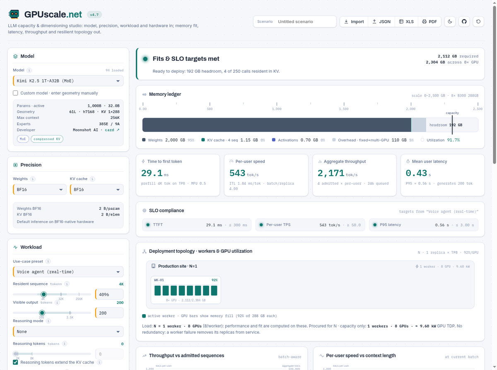
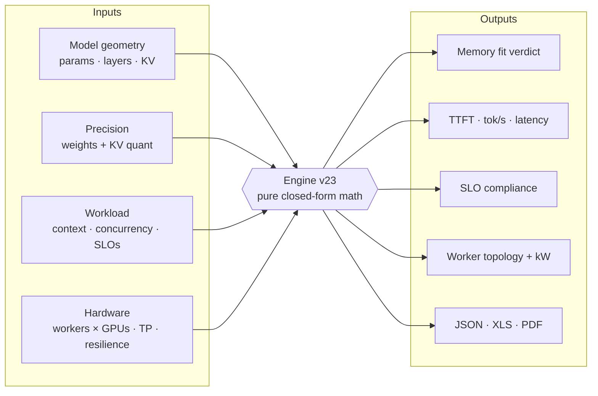

<p align="center"></p>

<p align="center">
  <a href="https://gpuscale.net/"></a>
  <a href="https://github.com/mahmoudyassine/gpu-scale-tool/releases"></a>
  <a href="LICENSE"></a>
  
</p>

# GPUscale.net

**Plan self-hosted LLM deployments in your browser.** Build a project from one
or many use cases (RAG copilot, voice agent, document intake), pick hardware
once, and get memory fit, latency, SLO compliance, a resilient topology and a
fleet map of every model on every GPU, supporting models included. Free, open
source, and fully static: no backend, no build step, nothing uploaded.

**▶ Try it now: https://gpuscale.net/**



## ✨ Features

- 🗂️ **Projects with multiple use cases**: each card has its own workload, concurrency, SLOs and model; same model + precision is served by one shared pooled deployment, sized for the combined load
- 🤝 **Supporting models auto-attach**: embeddings and rerankers for RAG, ASR and TTS for voice, OCR for documents, guard models for public chat; placed on MIG slices, AMD partitions or fractional GPUs with honest footprints
- 🗺️ **Fleet map**: every node and GPU drawn with its assignment: replicas, support slices, spares and standby nodes, plus a screen-reader text form
- 🎚️ **Two modes**: Normal asks for people at peak and derives the rest; Advanced exposes every control
- 🧮 **Memory fit**: weights, KV cache, activations and overhead per replica, against real fleet capacity
- ⚡ **Performance**: time to first token, per-user tok/s, aggregate throughput, latency anatomy
- 🎯 **SLO compliance**: set TTFT / TPS / P95 targets and see pass or fail as you tune
- 🏗️ **Resilient topology**: N, N+1, N+2, N+N, DR (full or half-size), Active/Active and N+N+DR, with guaranteed-vs-normal-day economics and workers/GPUs/kW roll-ups
- 💾 **Projects persist**: autosaved to your browser's local storage, surviving reboots; a history menu lists, reloads and deletes them
- 🔗 **Share links**: the whole project travels compressed inside the URL itself; send the link, they see your project (an optional self-hosted backend for short links ships in docs/share-worker.js)
- 🔒 **Private by design**: everything runs and stays in your browser; nothing is uploaded or tracked
- 📚 **Library**: 94 models (GQA, MoE, MLA, SSM hybrids, Arabic/GCC sovereign set), 37 GPUs with partitioning profiles, and 17 supporting models, one line each
- 📤 **Exports**: JSON configs, an Excel template with live formulas, and a print-ready PDF report
- 🪄 **Auto-size**: one click picks the TP that fits one copy of the model and the workers that admit your peak load
- 🌓 **Polished**: light and dark themes, mobile friendly, installable, keyboard accessible

## 🚀 Quick start

| | How |
|---|---|
| **Use it online** | Open [the live studio](https://gpuscale.net/) |
| **Run it locally** | Clone and double-click `index.html` (no server needed), or `python3 -m http.server 8080` |
| **Carry one file** | Grab [`dist/gpuscale_standalone.html`](dist/gpuscale_standalone.html): the whole studio in a single portable HTML file |

## 🧠 How it works



The engine is ~40 lines of pure math in `assets/app.js` (between
`/*ENGINE-START*/` and `/*ENGINE-END*/`), mirrored cell-for-cell by the Excel
export. Core relations:

```
weights    = params x bytes/weight                     (per replica)
KV/token   = 2 x layers x kvHeads_eff x headDim_eff x bytes/KV
VRAM total = replicas x (weights + activations) + KV total + overhead
TPS/user   = BW x TP x IC x MBU / (active x bytes + batch/replica x seq x KV/token)
TTFT       = 2 x seq x active / (TFLOPS x TP x MFU)
```

All figures are peak estimates; production typically achieves 70 to 90 percent.
Validate with vLLM bench or GenAI-Perf before committing hardware.

## 📋 Example: Llama 3.1 70B on one HGX H100

Internal-copilot workload: FP8 weights and KV, 16K resident context, 64
concurrent calls, batch 16, one worker with 8x H100 80GB at TP8.

| Metric | Result |
|---|---|
| VRAM required | 224 GB of 640 GB (35%), fits ✅ |
| Time to first token | 580 ms |
| Per-user speed | 131 tok/s |
| Aggregate throughput | ~2,100 tok/s (16 admitted, rest queue) |
| Mean request latency | 6.7 s |

Change any slider and every number, chart and the topology diagram update live.

## 🗂️ Project layout

```
index.html                     page markup only
assets/    styles.css          all styling (light + dark via CSS variables)
           app.js              engine, charts, topology, exports
data/      models.js gpus.js   the libraries: one entry per line,
           quants.js usecases.js   edit these to maintain the tool
tools/     build_single_file.py    rebuilds the portable one-file version
dist/      gpuscale_standalone.html  the portable build (generated)
docs/      DATA.md             schemas + effective-KV convention
```

## 🧩 Add a model or GPU

One line in `data/models.js` or `data/gpus.js`:

```js
{"name":"MyModel 34B","params":34.0,"active":34.0,"hidden":7168,"layers":60,
 "kvHeads":8,"headDim":128,"ctx":131072, ...}
```

MoE, MLA and hybrid-attention models use an *effective KV* encoding so the
engine lands on their true cache cost. See **[docs/DATA.md](docs/DATA.md)** for
the schemas, the convention, and worked examples.

## 🌐 Deploy your own

Copy the folder to any static host: GitHub Pages, S3, or an internal server.
Nothing to compile. This repo serves the root directly on GitHub Pages; every
push to `main` goes live within a minute.

To attach a custom domain, point DNS at GitHub Pages and set the domain in
Settings → Pages. A ready-to-import Cloudflare zone file for `gpuscale.net`
lives at [docs/dns-cloudflare.txt](docs/dns-cloudflare.txt). Import it under
Cloudflare → DNS → Import, keep the records unproxied (grey cloud) until the
GitHub certificate is issued, then set the custom domain in GitHub and enable
Enforce HTTPS.

## 🤖 Claude Code skill

The `skill/` directory packages this engine as a [Claude Code](https://claude.com/claude-code)
skill: copy it to `~/.claude/skills/gpu-sizing/` and Claude answers GPU sizing
questions by running the real engine CLI (same math, same libraries) instead
of estimating. `node skill/sizing.mjs --help` works standalone too.

## 🤝 Contributing

Model and GPU library updates are one-line edits (see above). Please keep the
effective-KV convention and flag undisclosed internals with `est. cfg`. Bug
reports and fixes are welcome via [issues](https://github.com/mahmoudyassine/gpu-scale-tool/issues).

## 📄 License

[MIT](LICENSE) · © 2026 GPUscale.net

The code and data are MIT-licensed: use them freely, commercially included.
The **GPUscale name, robot logo and the gpuscale.net domain are not part of
the license**: forks and rehosted versions are welcome, but please ship them
under your own name and branding.
