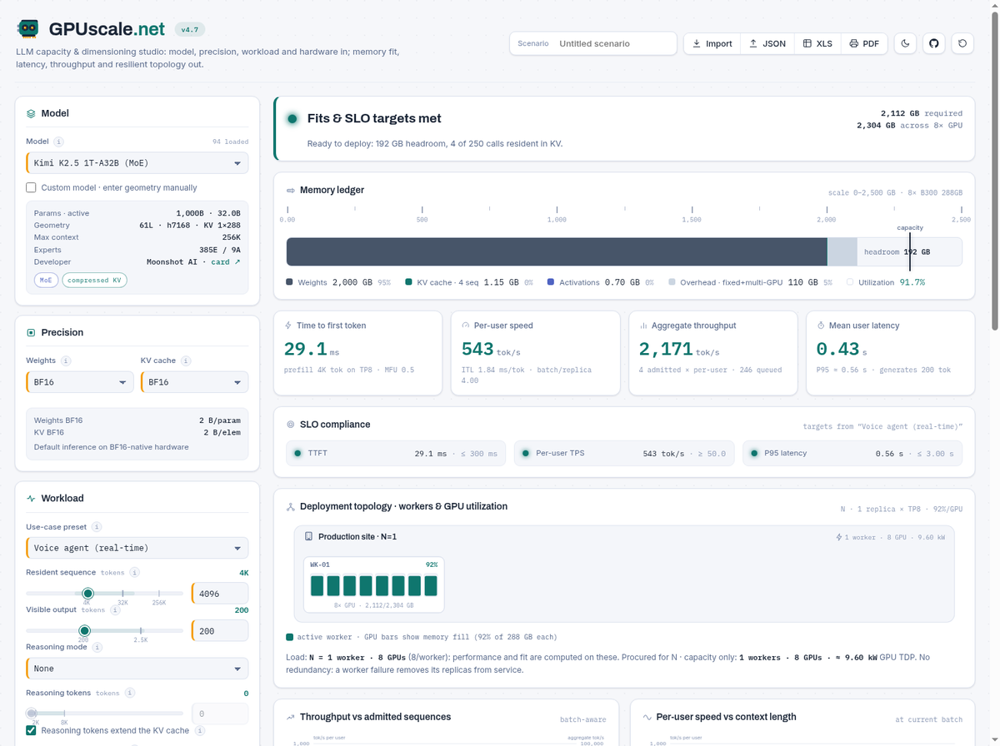
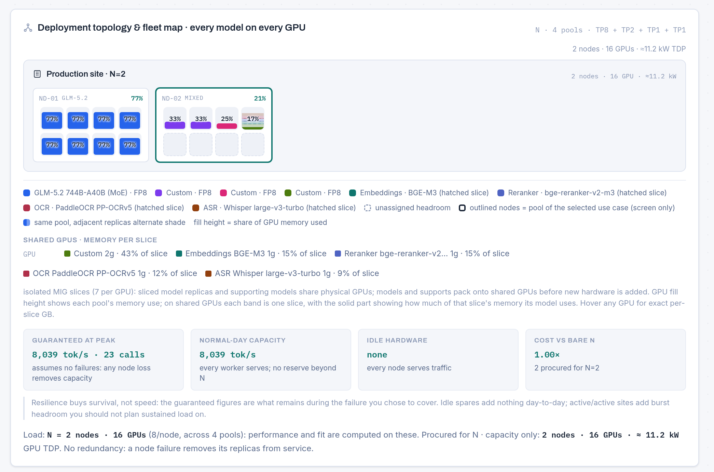
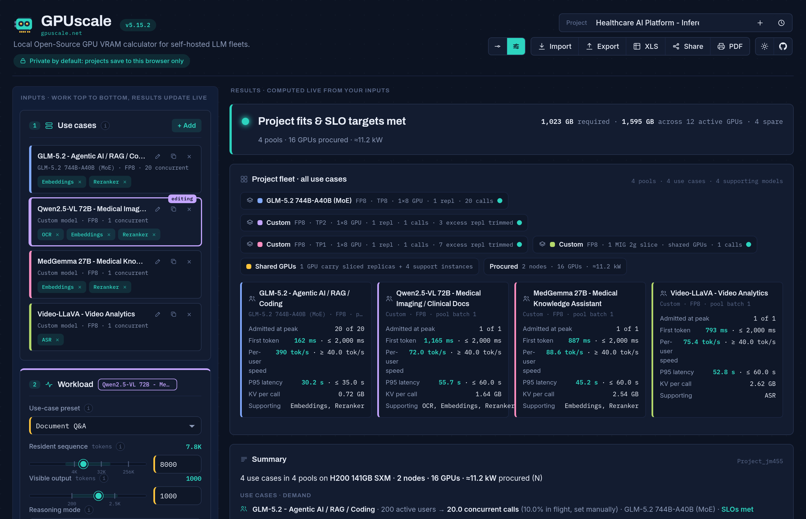
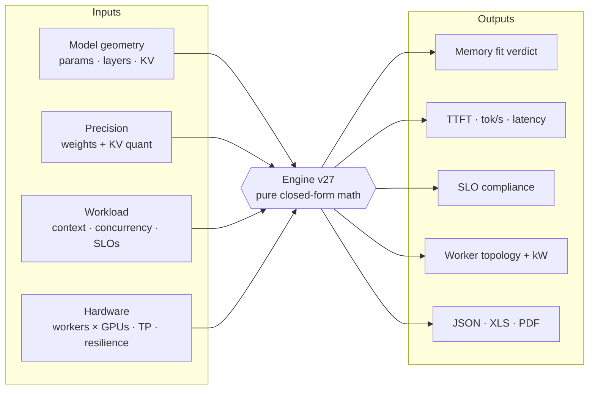

<p align="center">
  <picture>
    <source media="(prefers-color-scheme: dark)" srcset="assets/logo-robot-dark.svg">
    
  </picture>
</p>

<p align="center">
  <a href="https://gpuscale.net/"></a>
  <a href="https://github.com/mahmoudyassine/gpu-scale-tool/releases"></a>
  <a href="https://gpuscale.net/manual.html"></a>
  <a href="LICENSE"></a>
  
</p>

# GPUscale.net

**Local Open-Source GPU VRAM calculator for self-hosted LLM fleets.** Build a
project from one or many use cases (RAG copilot, voice agent, medical imaging,
document intake), pick hardware once, and get memory fit, latency, SLO
compliance, a resilient topology and a fleet map of every model on every GPU,
supporting models and MIG-shared GPUs included. Free, open source, and fully
static: no backend, no build step, nothing uploaded.

**▶ Try it now: https://gpuscale.net/**  ·  **📖 Manual: https://gpuscale.net/manual.html**



## ✨ Features

- 🗂️ **Projects with multiple use cases**: each card has its own workload, concurrency, SLOs and model; same model + precision is served by one shared pooled deployment, sized for the combined load
- 🍰 **GPU sharing (MIG slicing)**: in multi-use-case projects, small-model pools can run one replica per hardware slice and share physical GPUs with other models and supporting services, the way Triton and vLLM deployments do on partitioned clusters; only real slice geometries, honest per-slice speed
- 🤝 **Supporting models auto-attach**: embeddings and rerankers for RAG, ASR and TTS for voice, OCR for documents, guard models for public chat; placed on MIG slices, AMD partitions or fractional GPUs with honest footprints
- 🗺️ **Fleet map**: every node and GPU drawn with its assignment: replicas, support slices, spares and standby nodes, plus a screen-reader text form
- 🎚️ **Two modes**: Normal asks for people at peak and derives the rest; Advanced exposes every control
- 🧮 **Memory fit**: weights, KV cache, activations and overhead per replica, against real fleet capacity
- ⚡ **Performance**: time to first token, per-user tok/s, aggregate throughput, latency anatomy
- 🎯 **SLO compliance**: set TTFT / TPS / P95 targets and see pass or fail as you tune
- 🏗️ **Resilient topology**: N, N+1, N+2, N+N, DR (full or half-size), Active/Active and N+N+DR, with guaranteed-vs-normal-day economics and workers/GPUs/kW roll-ups
- 💾 **Projects persist**: autosaved to your browser's local storage, surviving reboots; a history menu lists, reloads and deletes them
- 🔗 **Share links**: the whole project travels compressed inside the URL itself; send the link, they see your project (an optional self-hosted backend for short links ships in docs/share-worker.js)
- 🔒 **Private by design**: everything runs and stays in your browser; nothing is uploaded or tracked
- 📚 **Library**: 24 workload presets with SLO targets grounded in published practice (see [docs/PRACTICES.md](docs/PRACTICES.md)), 101 models (GQA, MoE, MLA, SSM hybrids, a deep Arabic/GCC sovereign set incl. VLMs and dialect models), 37 GPUs with partitioning profiles, and 54 supporting models (with Arabic-specialized ASR, TTS, OCR, embeddings, rerankers and guards) (embeddings, rerankers, ASR, TTS, OCR, guards from tiny CPU-viable to flagship tiers), one line each
- 📤 **Exports**: JSON configs, an Excel template with live formulas, and a print-ready PDF report
- 🪄 **Auto-size**: one click picks the TP that fits one copy of the model and the workers that admit your peak load
- 🎯 **SLO optimiser**: decode re-reads `bandwidth × interconnect × MBU / target tok/s` GB per card per token, so the speed target sizes the fleet. Recommendations propose the targets that fill the GPU you already chose, bounded by each use case's P95 promise and its workload class (a live voice path is never asked to read at 19 tok/s), priced by re-solving the whole project, and applied across use cases in one click with a single Undo
- 🧾 **It tells you which promise is buying the hardware**: when a P95 target implies a higher per-user speed than the tok/s target does, lowering the speed target cannot shrink anything, and the tool says so and offers the P95 instead. When the cards look empty it itemises the order: cards held by the speed and P95 promises, by the first-token targets, by the admission and KV floor, by whole-node rounding, and by the resilience pattern
- 🧠 **Prefix-cache aware**: tell it what share of the sequence is byte-identical every call (a system prompt, a tool schema, a few-shot block) and the engine prefills only the rest and holds the shared KV once per replica. When a project has a long resident context and no fraction set, the optimiser prices two levels and offers them as buttons, saying plainly that you should only accept them if your stack has prefix caching on
- 🩺 **Fix-it buttons on the findings**: KV cache to FP8, weights to FP8, a reachable P95, reasoning off, N+1 redundancy, a tensor-parallel width, a batch cap - each one applies across the use cases in scope, re-solves, and offers one Undo
- 📖 **A real manual**: [gpuscale.net/manual.html](https://gpuscale.net/manual.html) documents every control and every readout with screenshots, and derives the whole engine from first principles with diagrams and a worked example you can check on a calculator. Reachable from the book icon in the studio's toolbar
- 🌓 **Polished**: light and dark themes, mobile friendly, installable, keyboard accessible
- 🤖 **Claude skill**: download `gpuscale-link.skill` from the footer, hand it to Claude, and it turns plain-language requirements into a ready, verified share link (gpuscale.net + mirror)
- 🔗 **Readable links any AI can write**: `#p=t:gpu=H200+141GB+NVL;uc=Support+chat;model=Llama+3.3+70B;preset=Simple+RAG;users=2000` opens a fully sized fleet. Plain text, no compression, no tooling, so ChatGPT, Gemini or Claude can answer a sizing question with a working link instead of arithmetic. Spec in [docs/URL-FORMAT.md](docs/URL-FORMAT.md)

## 🗺️ Fleet map & GPU sharing

Every node and GPU drawn with its assignment; shared GPUs show each MIG
slice's memory with a per-slice breakdown, and the sizing decision explains
dedicated-vs-sliced choices per pool.



Dark theme, same project:



## 🚀 Quick start

| | How |
|---|---|
| **Use it online** | Open [the live studio](https://gpuscale.net/) |
| **Run it locally** | Clone and double-click `index.html` (no server needed), or `python3 -m http.server 8080` |
| **Carry one file** | Grab [`dist/gpuscale_standalone.html`](dist/gpuscale_standalone.html): the whole studio in a single portable HTML file |

## 📖 Documentation

| Document | What it covers |
|---|---|
| **[The manual](https://gpuscale.net/manual.html)** | The complete guide: quick start, every control and readout with screenshots, the full mathematics with diagrams and a worked example, the solver, pooling and MIG slicing, resilience patterns, the SLO optimiser, exports, and a glossary. Also the book icon in the studio's toolbar. |
| [docs/DATA.md](docs/DATA.md) | Data schemas, the effective-KV convention, card stamps, co-residency gates, solver invariants and the engine version history. |
| [docs/PRACTICES.md](docs/PRACTICES.md) | The published evidence every workload preset is calibrated against, and the 2026 review of all of them. |
| [docs/URL-FORMAT.md](docs/URL-FORMAT.md) | How to build a configuration link, written for AI assistants and for scripts. |
| [docs/V5-DESIGN.md](docs/V5-DESIGN.md) | The v5 architecture decisions. |
| [llms.txt](llms.txt) | A machine-readable summary of the whole tool for agents. |
| [CHANGELOG.md](CHANGELOG.md) | Every release with its reasoning, its corrections and its verification numbers. |

## 🧠 How it works


```mermaid
flowchart LR
    subgraph Inputs
        M[Model geometry<br>params · layers · KV]
        P[Precision<br>weights + KV quant]
        W[Workload<br>context · concurrency · SLOs]
        H[Hardware<br>workers × GPUs · TP · resilience]
    end
    E{{Engine v27<br>pure closed-form math}}
    subgraph Outputs
        F[Memory fit verdict]
        K[TTFT · tok/s · latency]
        S[SLO compliance]
        T[Worker topology + kW]
        X[JSON · XLS · PDF]
    end
    M --> E
    P --> E
    W --> E
    H --> E
    E --> F
    E --> K
    E --> S
    E --> T
    E --> X
```

The engine is ~50 lines of pure math in `assets/app.js` (between
`/*ENGINE-START*/` and `/*ENGINE-END*/`), mirrored cell-for-cell by the Excel
export. Core relations:

```
weights    = params x bytes/weight                     (per replica)
KV/token   = 2 x layers x kvHeads_eff x headDim_eff x bytes/KV
cached     = floor(resident x shared prefix fraction)  (prefilled once)
unique     = seq - cached                              (per call)
KV total   = calls x unique x KV/token + replicas x cached x KV/token
VRAM total = replicas x (weights + activations) + KV total + 5 GB
             + replicas x (TP-1) x 15 GB   (NCCL, inside a replica only)
TPS/user   = BW x TP x IC x MBU / (active x bytes + batch/replica x seq x KV/token)
TTFT       = 2 x (resident - cached) x active / (TFLOPS x TP x MFU)
```

The shared-prefix fraction is 0 unless you set it, so the default sizing charges
a full prefill on every call. Set it and the engine prefills only the unique part
and holds the shared block once per replica, which is what a server with
automatic prefix caching does. Decode is deliberately not discounted: every call
still re-reads its whole context on every token, so the fraction moves
first-token time and KV memory and nothing else.

All figures are peak estimates; production typically achieves 70 to 90 percent.
Validate with vLLM bench or GenAI-Perf before committing hardware.

The workload presets carry SLO targets grounded in published practice (MLPerf
Inference v6.0 latency constraints, 2026 TTFT/ITL guidance, voice-agent budget
decompositions, measured agentic token consumption). The evidence for each one,
and a July 2026 review of all of them, is in
**[docs/PRACTICES.md](docs/PRACTICES.md)**.

## 📋 Example: Llama 3.1 70B on one HGX H100

Internal-copilot workload: FP8 weights and KV, 16K resident context, 64
concurrent calls, batch 16, one worker with 8x H100 80GB at TP8.

| Metric | Result |
|---|---|
| VRAM required | 224 GB of 640 GB (35%), fits ✅ |
| Time to first token | 580 ms |
| Per-user speed | 131 tok/s |
| Aggregate throughput | ~2,100 tok/s (16 admitted, rest queue) |
| Mean request latency | 6.7 s |

Change any slider and every number, chart and the topology diagram update live.

## 🗂️ Project layout

```
index.html                     page markup only
manual.html                    the manual (self-contained page)
assets/    styles.css          all styling (light + dark via CSS variables)
           app.js              engine, charts, topology, exports
data/      models.js gpus.js   the libraries: one entry per line,
           quants.js usecases.js   edit these to maintain the tool
           support.js
tools/     build_single_file.py    rebuilds the portable one-file version
           build_skill.py          regenerates skill/sizing.mjs from the live engine
           build_skill_link.py     regenerates gpuscale-link.skill + its tables
           check_presets.py        enforces the workload-preset rules
dist/      gpuscale_standalone.html  the portable build (generated)
skill/     the gpu-sizing CLI skill (generated)
skill-link/  the gpuscale-link skill sources (share-link builder)
docs/      DATA.md             schemas, effective-KV convention, solver notes
           URL-FORMAT.md       how to build a link (for AI assistants, scripts)
           manual/             manual stylesheet + captured screenshots
           PRACTICES.md        the serving evidence the presets are calibrated on
           V5-DESIGN.md        the v5 architecture decisions
```

Everything generated is rebuilt by running the three `tools/build_*.py`
scripts; do that on every release so the portable build and both skills cannot
drift from `assets/app.js` and `data/`.

## 🧩 Add a model or GPU

One line in `data/models.js` or `data/gpus.js`:

```js
{"name":"MyModel 34B","params":34.0,"active":34.0,"hidden":7168,"layers":60,
 "kvHeads":8,"headDim":128,"ctx":131072, ...}
```

MoE, MLA and hybrid-attention models use an *effective KV* encoding so the
engine lands on their true cache cost. See **[docs/DATA.md](docs/DATA.md)** for
the schemas, the convention, and worked examples.

## 🌐 Deploy your own

Copy the folder to any static host: GitHub Pages, S3, or an internal server.
Nothing to compile. This repo serves the root directly on GitHub Pages; every
push to `main` goes live within a minute.

To attach a custom domain, point DNS at GitHub Pages and set the domain in
Settings → Pages. A ready-to-import Cloudflare zone file for `gpuscale.net`
lives at [docs/dns-cloudflare.txt](docs/dns-cloudflare.txt). Import it under
Cloudflare → DNS → Import, keep the records unproxied (grey cloud) until the
GitHub certificate is issued, then set the custom domain in GitHub and enable
Enforce HTTPS.

## 🔗 Ask an AI assistant for a link

Any assistant can answer a sizing question with a link that opens the sized
fleet, instead of arithmetic nobody can check. The readable link form is plain
text, so ChatGPT, Gemini, Claude or anything else can write one with no tools:

```
https://gpuscale.net/#p=t:gpu=H200+141GB+NVL;perw=8;resil=n1;uc=Support+chat;model=Llama+3.3+70B;quant=FP8;preset=Simple+RAG;users=2000
```

`key=value` pairs separated by `;`, every `uc=` starts a use case, spaces are
`+`. It describes the workload; the studio solves tensor parallelism, replicas,
batch size and the node topology on import. There are also `#p=j:` (base64 JSON)
and `#p=z:` (deflate + base64) forms for callers that can run code.

**[docs/URL-FORMAT.md](docs/URL-FORMAT.md)** is the complete specification: every
key, worked examples, the encoding recipes, and the rules that keep an assistant
from producing a link that is wrong in a way the user cannot see. Point your
assistant at it, or at [llms.txt](llms.txt), and it can build links unaided.
Every valid model, GPU, preset and quantization name is listed in
[skill-link/references/libraries.md](skill-link/references/libraries.md).

In the page, `GPUscale.textShare()` prints the readable link for whatever is on
screen, which is the quickest way to learn the format.

## 🤖 Claude Code skill

The `skill/` directory packages the engine as a [Claude Code](https://claude.com/claude-code)
skill: copy it to `~/.claude/skills/gpu-sizing/` and Claude answers GPU sizing
questions by running a CLI instead of estimating. `node skill/sizing.mjs --help`
works standalone too. `sizing.mjs` is **generated** by `tools/build_skill.py`,
which embeds the engine block and the auto-size solver verbatim from
`assets/app.js` and the listings verbatim from `data/*.js`, so the CLI cannot
drift from the studio; it is rebuilt on every release. It sizes one dedicated
pool per invocation (the multi-use-case pooling, GPU sharing and supporting
models live in the studio).

## 🤝 Contributing

Model and GPU library updates are one-line edits (see above). Please keep the
effective-KV convention and flag undisclosed internals with `est. cfg`.

Changing a workload preset moves every project that uses it, so treat the
numbers as evidence-backed: cite the source in [docs/PRACTICES.md](docs/PRACTICES.md)
and run `python3 tools/check_presets.py`, which fails on any preset demanding a
P95 its own first-token and speed targets make impossible. Bug reports and fixes
are welcome via [issues](https://github.com/mahmoudyassine/gpu-scale-tool/issues).

## 📄 License

[MIT](LICENSE) · © 2026 GPUscale.net

The code and data are MIT-licensed: use them freely, commercially included.
The **GPUscale name, robot logo and the gpuscale.net domain are not part of
the license**: forks and rehosted versions are welcome, but please ship them
under your own name and branding.
